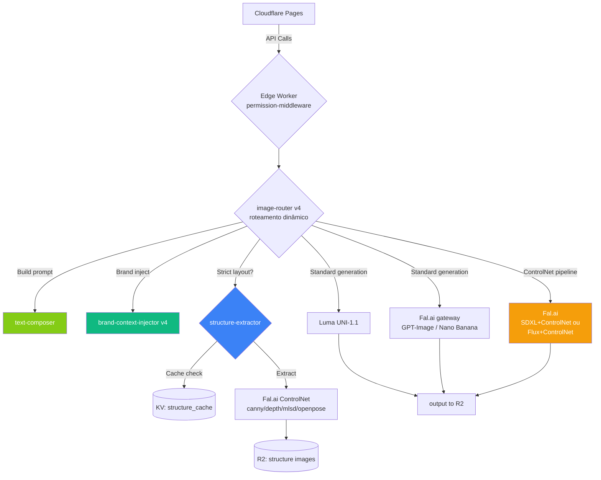
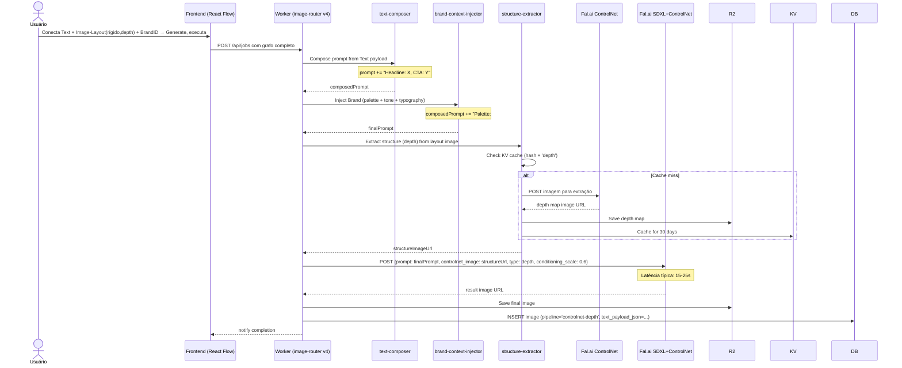

# Arquitetura v4 — Mudanças Incrementais sobre v3

> **Versão 4** — documento incremental focado **apenas nas mudanças** em relação à v3. Toda a base permanece: Cloudflare Pages + Workers + R2 + D1 + Queues + KV, Clerk Organizations para multi-tenancy, schema D1 com Brand Context.
>
> Foco: nova lógica de roteamento dinâmico (que depende dos nós conectados), ControlNet via Fal.ai, worker `structure-extractor`, validação de tipos no React Flow, cache agressivo de extrações.

---

## 1. O que mudou conceitualmente

Na v3, o Brand Context era um **chip global** no topo do canvas. Toda geração no workflow lia esse contexto. Na v4, a identidade vira **um nó plugável** (`Brand ID`) conectado individualmente a cada nó de IA. Isso muda três coisas técnicas:

1. **Worker `brand-context-injector` agora recebe o payload do grafo** (qual Brand ID está conectado a qual nó), não mais de uma configuração global
2. **Roteamento de provedores é dinâmico** baseado nos nós conectados (Image-Layout em modo rígido força Fal.ai SDXL/Flux + ControlNet)
3. **React Flow ganha validação de tipos de conexão** — handles tipados não permitem conexões inválidas

O schema D1 da v3 permanece **100% válido** — Brand Context, paletas, fontes, refs, shares, audit_log, roles, tudo igual. Só muda como o frontend constrói o payload e como o backend interpreta.

## 2. Workers Atualizados ou Novos

### 2.1. `brand-context-injector` (modificado)

Antes (v3): lia o cliente vigente do contexto global do workflow.

Agora (v4): recebe lista de `(nodeId, brandPayload)` extraída do grafo. Cada `Generate`/`Edit`/etc. tem seu próprio Brand ID conectado (ou nenhum). O injector aplica por nó.

```typescript
// v4 — recebe payload por nó
interface InjectionRequest {
  nodeId: string;
  originalPrompt: string;
  brandPayload?: {
    clientId: string;
    toggles: {
      applyPalette: boolean;
      applyTypography: boolean;
      applyBrandTone: boolean;
      applyArtRefs: boolean;  // novo — controlado pelo toggle do nó Brand ID
    };
  };
  layoutPayload?: LayoutPayload;
  textPayload: TextPayload;  // sempre presente
  nodeType: NodeType;
}
```

A lógica de injeção em si é igual à v3 — só a fonte do payload mudou.

### 2.2. `structure-extractor` (NOVO)

Worker dedicado a extrair estrutura de imagem via ControlNet. Chamado quando `Image-Layout` está em modo rígido.

```typescript
async function extractStructure(
  imageBuffer: Buffer,
  controlType: 'canny' | 'depth' | 'mlsd' | 'openpose'
): Promise<{ structureImageUrl: string; cached: boolean }> {
  const cacheKey = `structure:${controlType}:${await sha256(imageBuffer)}`;

  // Cache 30 dias — estrutura de uma imagem não muda
  const cached = await KV.get(cacheKey);
  if (cached) return { structureImageUrl: cached, cached: true };

  const falKey = await getApiKey('falai');
  const endpoint = {
    canny: 'fal-ai/controlnet-canny',
    depth: 'fal-ai/controlnet-depth',
    mlsd: 'fal-ai/controlnet-mlsd',
    openpose: 'fal-ai/controlnet-openpose',
  }[controlType];

  const result = await fetch(`https://fal.run/${endpoint}/preprocess`, {
    method: 'POST',
    headers: {
      'Authorization': `Key ${falKey}`,
      'Content-Type': 'application/json',
    },
    body: JSON.stringify({
      image_url: await getR2SignedUrl(imageBuffer),
    }),
  });

  const data = await result.json();
  const structureUrl = await saveStructureToR2(data.image.url);

  await KV.put(cacheKey, structureUrl, { expirationTtl: 30 * 86400 });
  return { structureImageUrl: structureUrl, cached: false };
}
```

**Custos:** ~$0.005 por extração ControlNet. Cache reduz drasticamente em workflows duplicados (uso típico de agência criando variações por cliente).

### 2.3. `image-router` (modificado — roteamento dinâmico)

Antes (v3): selecionava provedor baseado em `preferredProvider` do usuário e tipo de operação.

Agora (v4): considera **a topologia do grafo** para decidir.

```typescript
interface LayoutPayload {
  image: string;
  fidelity: number;        // 0-100 em steps de 10
  techMode: 'auto' | 'force_inspiration' | 'force_strict';
  controlType: 'canny' | 'depth' | 'mlsd' | 'openpose';
}

function getPipelineMode(layout: LayoutPayload): 'inspiration' | 'controlnet' {
  if (layout.techMode === 'force_inspiration') return 'inspiration';
  if (layout.techMode === 'force_strict') return 'controlnet';
  // Auto: threshold em 50%
  return layout.fidelity <= 50 ? 'inspiration' : 'controlnet';
}

function getConditioningScale(layout: LayoutPayload): number {
  if (layout.techMode === 'force_strict') {
    // Modo forçar rígido: slider mapeia diretamente
    return layout.fidelity / 100;
  }
  // Modo auto, slider acima de 50: (slider - 50) / 50
  // Ex: 60% → 0.2, 70% → 0.4, 80% → 0.6, 100% → 1.0
  return (layout.fidelity - 50) / 50;
}

async function routeGeneration(req: GenerationRequest): Promise<RoutingDecision> {
  const { nodeType, textPayload, brandPayload, layoutPayload, preferredProvider } = req;

  // Regra 1: Image-Layout em pipeline ControlNet força Fal.ai SDXL/Flux
  if (layoutPayload && getPipelineMode(layoutPayload) === 'controlnet') {
    const structure = await structureExtractor.extract(
      layoutPayload.image,
      layoutPayload.controlType
    );

    return {
      provider: 'falai',
      model: 'fal-ai/sdxl-controlnet',
      params: {
        prompt: textPayload.composedPrompt,
        controlnet_image: structure.structureImageUrl,
        controlnet_conditioning_scale: getConditioningScale(layoutPayload),
        controlnet_type: layoutPayload.controlType,
      },
      notes: `Pipeline ControlNet ativo (fidelidade ${layoutPayload.fidelity}%, scale ${getConditioningScale(layoutPayload).toFixed(2)}). Provider sobrescrito para Fal.ai SDXL+ControlNet.`,
    };
  }

  // Regra 2: Image-Layout em pipeline inspiração + Edit → Luma com source
  if (layoutPayload && getPipelineMode(layoutPayload) === 'inspiration' && nodeType === 'edit') {
    return {
      provider: 'luma',
      model: 'uni-1.1',
      params: {
        type: 'image_edit',
        prompt: addInspirationStrength(textPayload.composedPrompt, layoutPayload.fidelity),
        source: layoutPayload.image,
        image_ref: brandPayload?.artRefs || [],
      },
    };
  }

  // Regra 3: Image-Layout em pipeline inspiração + Generate → provider preferido com image ref
  if (layoutPayload && getPipelineMode(layoutPayload) === 'inspiration' && nodeType === 'generate') {
    const provider = preferredProvider || 'gpt-image-2';
    return {
      provider,
      model: provider,
      params: {
        prompt: addInspirationStrength(textPayload.composedPrompt, layoutPayload.fidelity),
        image_reference: layoutPayload.image,
      },
    };
  }

  // Regra 4: Generate sem Layout → preferência do usuário
  if (nodeType === 'generate') {
    const provider = preferredProvider || 'gpt-image-2';
    return {
      provider,
      model: provider,
      params: { prompt: textPayload.composedPrompt },
    };
  }

  // Regras 5-7: edit, style, consistency etc. (igual v3)
  // ...
}

// Helper para adicionar instrução de intensidade no prompt em modo inspiração
function addInspirationStrength(prompt: string, fidelity: number): string {
  let strength: string;
  if (fidelity <= 20) strength = 'as a loose visual inspiration';
  else if (fidelity <= 40) strength = 'as a moderate reference';
  else strength = 'as a strong reference, maintaining the general structure';

  return `${prompt}\n\nUse the provided reference image ${strength}.`;
}
```

**Importante:** quando o roteamento é forçado (regra 1), o frontend recebe um aviso para mostrar no UI. O usuário vê em tempo real: "Provider: GPT-Image 2 → Fal.ai SDXL (forçado por Image-Layout rígido)".

### 2.4. `text-composer` (NOVO)

Worker pequeno que monta o `composedPrompt` a partir dos campos do nó Text.

```typescript
function composeTextPrompt(text: TextPayload, brand?: BrandPayload): string {
  let prompt = text.mainPrompt;

  // Adiciona copy estruturada quando presente
  const copyParts: string[] = [];
  if (text.headline) copyParts.push(`Headline text: "${text.headline}"`);
  if (text.subhead) copyParts.push(`Subhead: "${text.subhead}"`);
  if (text.cta) copyParts.push(`Call-to-action text: "${text.cta}"`);
  if (text.disclaimer) copyParts.push(`Small disclaimer text: "${text.disclaimer}"`);

  if (copyParts.length > 0) {
    prompt += '\n\nInclude the following text elements:\n' + copyParts.map(p => '- ' + p).join('\n');
  }

  // Adiciona Brand (delegado ao brand-context-injector)
  if (brand) {
    prompt = applyBrandInjection(prompt, brand);
  }

  return prompt;
}
```

Modelos como Nano Banana 2 e GPT-Image 2 respondem **muito melhor** a prompts com instruções de texto estruturado do que a um prompt monolítico tipo "banner promocional com 50% off escrito grande".

## 3. Schema D1 — Adições Mínimas

A v3 já cobria quase tudo. Apenas duas adições:

```sql
-- Cache de extrações de estrutura (auxiliar ao KV)
CREATE TABLE structure_cache (
  id TEXT PRIMARY KEY,
  image_hash TEXT NOT NULL,
  control_type TEXT NOT NULL,
  r2_key TEXT NOT NULL,
  org_id TEXT REFERENCES organizations(id),
  created_at INTEGER DEFAULT (unixepoch()),
  last_used_at INTEGER DEFAULT (unixepoch()),
  UNIQUE(image_hash, control_type)
);
CREATE INDEX idx_structure_hash ON structure_cache(image_hash);

-- Adicionar coluna no images para rastrear pipeline usado
ALTER TABLE images ADD COLUMN pipeline TEXT;
-- valores: 'standard' | 'controlnet-canny' | 'controlnet-depth' | etc.

-- Adicionar campos do nó Text estruturado no workflow
-- (já guardado no graph_json, mas indexável para busca)
ALTER TABLE images ADD COLUMN text_payload_json TEXT;
```

## 4. Tipos de Conexão no React Flow

Cada handle de nó tem um **tipo** que define o que pode conectar. Implementação via custom edges com validação:

```typescript
type ConnectionType = 'text' | 'image' | 'brand' | 'layout' | 'output';

const connectionRules: Record<NodeType, {
  inputs: Record<string, ConnectionType[]>;
  outputs: Record<string, ConnectionType[]>;
}> = {
  Text:           { inputs: {},                                              outputs: { out: ['text'] } },
  ImageInput:     { inputs: {},                                              outputs: { out: ['image'] } },
  BrandID:        { inputs: {},                                              outputs: { out: ['brand'] } },
  ImageLayout:    { inputs: { img: ['image'] },                              outputs: { out: ['layout'] } },

  Generate:       { inputs: { text: ['text'], layout: ['layout'], brand: ['brand'] }, outputs: { out: ['image'] } },
  Edit:           { inputs: { text: ['text'], src: ['image', 'layout'], brand: ['brand'] }, outputs: { out: ['image'] } },
  StyleTransfer:  { inputs: { src: ['image', 'layout'], brand: ['brand'] }, outputs: { out: ['image'] } },
  ConsistencyPack:{ inputs: { text: ['text'], brand: ['brand'] },            outputs: { out: ['image'] } },
  Upscale:        { inputs: { src: ['image'] },                              outputs: { out: ['image'] } },
  PromptAgent:    { inputs: { text: ['text'], brand: ['brand'] },            outputs: { out: ['text'] } },

  Output:         { inputs: { img: ['image'] },                              outputs: {} },
};

// Validador chamado pelo React Flow ao tentar conectar
function isValidConnection(connection: Connection): boolean {
  const sourceTypes = connectionRules[connection.sourceNodeType].outputs[connection.sourceHandle];
  const targetTypes = connectionRules[connection.targetNodeType].inputs[connection.targetHandle];
  return sourceTypes.some(t => targetTypes.includes(t));
}
```

**Cores das edges no UI:**
- `text` → verde claro
- `image` → cinza neutro
- `brand` → roxo
- `layout` → azul
- `output` → contorno escuro

## 5. Diagrama de Arquitetura v4 (incremental)



## 6. Fluxo: Geração com Brand + Image-Layout Rígido + Text Estruturado



## 7. Performance e Custos — Impacto da v4

### Latências

| Operação | v3 | v4 com Image-Layout rígido |
|---|---|---|
| Generate sem Layout | 5-15s (GPT-Image) | igual |
| Generate com Layout inspiração | 5-15s (passa como ref) | igual |
| **Generate com Layout rígido (cache miss)** | n/a | **20-30s** (3-5s extração + 15-25s SDXL+ControlNet) |
| **Generate com Layout rígido (cache hit)** | n/a | **15-25s** (só SDXL+ControlNet) |

### Custos por geração

| Tipo | Custo |
|---|---|
| GPT-Image padrão | $0.05 |
| Luma edit | $0.04 |
| **Layout inspiração (não muda)** | igual aos acima |
| **Layout rígido (cache miss)** | $0.005 (extração) + $0.03 (SDXL+CN) = $0.035 |
| **Layout rígido (cache hit)** | $0.03 (só SDXL+CN) |

### Cenário típico: agência usando "1 layout × 10 clientes"

- 1 extração de estrutura (cache miss): $0.005
- 10 gerações com cache hit: 10 × $0.03 = $0.30
- **Total: $0.305 para 10 banners completos** (paleta + fonte + diagramação consistente, conteúdo único por cliente)

Esse é o caso de uso onde o produto **destrói** Freepik Spaces em custo + tempo + consistência. Sem isso, designer faria manualmente, 30min por banner = 5 horas.

## 8. Cache Strategy Detalhada

A v4 depende fortemente de cache para custo. Três níveis:

| Cache | TTL | Quando invalida | Onde |
|---|---|---|---|
| Extração de paleta de imagem (v3) | 90 dias | Nunca (mesma imagem = mesma paleta) | KV |
| Extração de fonte WhatFontIs (v3) | 90 dias | Nunca | KV |
| Análise de tom Claude Vision (v3) | 90 dias | Nunca | KV |
| **Extração de estrutura ControlNet (v4)** | **30 dias** | **Quando user explicitamente "refresca"** | **KV + tabela D1** |
| Resultado de geração final | Nunca cacheado (cada execução é única) | n/a | n/a |

## 9. UX dos Avisos de Pipeline

Sempre que o roteamento é forçado pela topologia do grafo, o frontend mostra um banner discreto no nó Generate:

```
┌────────────────────────────────────┐
│ ⚙ Generate                         │
│                                    │
│ ⚠ Pipeline ajustado:               │
│ Layout rígido detectado.           │
│ Usando Fal.ai SDXL + ControlNet    │
│ (em vez de GPT-Image 2)            │
│                                    │
│ Custo estimado: $0.035             │
│ Latência estimada: 15-25s          │
│                                    │
│ [Trocar para Layout inspiração]    │
│ [Saber mais ▾]                     │
└────────────────────────────────────┘
```

Transparência total — usuário sempre entende o que está acontecendo e por quê.

## 10. Compatibilidade com v3

Workflows da v3 (com chip global) podem ser **migrados automaticamente**:

1. Detectar workflows que tinham `brand_context_json` na tabela `workflows`
2. Para cada nó Generate/Edit/etc. nesse workflow, inserir um nó BrandID no grafo conectado àquele nó, copiando os toggles
3. Marcar workflow como `migrated_to_v4 = 1`

Process pode rodar em background como Worker scheduled. Usuário vê seu workflow antigo abrir com BrandID já plugado, sem perder nada.

---

> Ver `03_Telas_v4.md` para detalhes do canvas atualizado.
